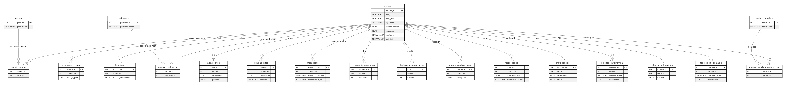

# 🧬 Protein Database Text-to-SQL

[](https://huggingface.co/spaces/RohanRamesh/proteinRAG)
[](LICENSE)
[](https://www.python.org/)
[](tests/)

**🚀 Live demo: [huggingface.co/spaces/RohanRamesh/proteinRAG](https://huggingface.co/spaces/RohanRamesh/proteinRAG)**
— ask it something like *"What genes are associated with beta-thalassemia?"*

Ask natural-language questions about proteins; they're translated to SQL, run
against a UniProt-derived Postgres database (12,000+ real reviewed human
entries), and answered in plain English.

```
question -> [Gemini: NL -> SQL] -> [SQL guard] -> Postgres -> [Gemini: rows -> NL answer]
```

This is a **text-to-SQL** system, not embedding/vector-based retrieval - "the
retrieval step" is literally running the generated SQL against the database.

The relational schema (`db/schema.sql`, 20 tables) is derived from UniProt's
own annotation model: proteins, functions, subcellular locations, active/binding
sites, mutagenesis, disease involvement, pathways, gene/family memberships, and
more:



Data is ingested directly from UniProt's REST API and parsed with Biopython
(`ingest/`).

## Features

- **Real data** - 12,000+ reviewed (Swiss-Prot) human protein entries across all 20 tables, not a toy demo set.
- **Safety by design** - LLM-generated SQL is validated as a single read-only statement (`rag/sql_guard.py`) *and* executed through a database role that only has `SELECT` privileges - defense in depth, not just a prompt instruction.
- **No LangChain, no ORM** - two plain Gemini calls and a direct `psycopg` connection. Fewer moving parts, easier to reason about.
- **Deployable on free-tier infra** - Gemini's free API tier + a free Postgres instance (Neon/Supabase) + a Hugging Face Space.

## Project layout

```
app.py               Gradio entrypoint
db/                   schema.sql + connection/init helpers
ingest/               UniProt fetch + parse + load pipeline
rag/                  SQL generation, answer generation, SQL safety guard
tests/                pytest unit tests (no network/DB required)
docs/SETUP.md         full setup, DB provisioning, and deployment guide
```

## Quickstart

See [docs/SETUP.md](docs/SETUP.md) for the full walkthrough (Postgres
provisioning, read-only role setup, ingestion, and Hugging Face Spaces
deployment). Short version:

```bash
python -m venv .venv
.venv/Scripts/activate        # .venv\Scripts\Activate.ps1 on PowerShell
pip install -r requirements-ingest.txt

cp .env.example .env          # fill in GEMINI_API_KEY, DATABASE_URL, INGEST_DATABASE_URL

python -m db.init_db                          # create the schema
python -m ingest.fetch_uniprot                # download a UniProt subset
python -m ingest.parse_and_load               # parse + load it

python app.py
```

## Safety

Generated SQL is checked to be a single read-only `SELECT`/`WITH` statement
(`rag/sql_guard.py`) before execution, and the deployed app should connect
with a database role that only has `SELECT` privileges - see
[docs/SETUP.md](docs/SETUP.md) for how to provision one. Both layers exist
because relying on either alone isn't enough: app-side validation can have
bugs, and a privileged DB connection has no fallback if it does.

## Tests

```bash
pytest tests/
```

Covers the SQL safety guard and the UniProt-record-to-schema field mapping
against real (trimmed) UniProt flat-file fixtures. No network or database
access required.
